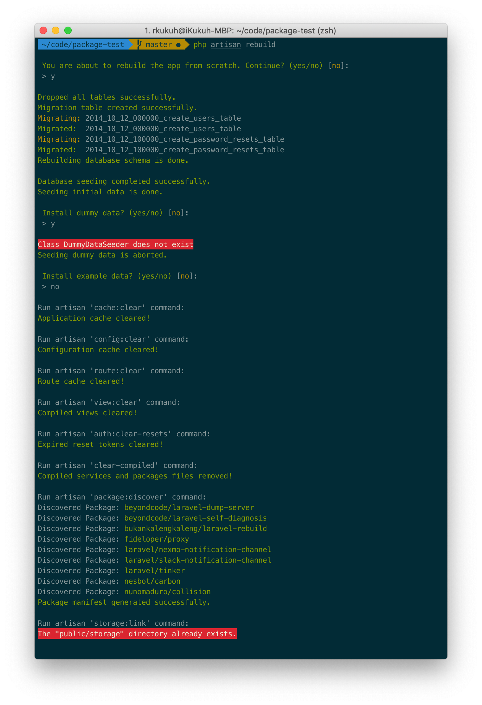

#  Laravel Rebuild ☄️

> Readme ini ditulis dalam bahasa Inggris. [Versi bahasa Indonesianya ada disini](https://github.com/bukankalengkaleng/laravel-rebuild/blob/master/README.md).

## Description

An artisan command to rebuild your app.

## Motivation

The rebuilding process of your app could take a time, by running artisan commands to do a clearing caches, making fresh database schema, seeding initial data, seeding dummy data (if any), importing files (if any), etc. This artisan command will make it easier.

## Installation

1. Run a `composer`
    ```
    composer require bukankalengkaleng/laravel-rebuild
    ```

    In Laravel 5.5 the service provider will automatically get registered. In older versions of the framework just add the service provider in `config/app.php` file:

    ```php
    'providers' => [
        // ...
        BukanKalengKaleng\LaravelRebuild\LaravelRebuildServiceProvider::class,
    ];
    ```
1. Make sure the connection to the database

## Usage

1. Run `rebuild` artisan command
    ```
    php artisan rebuild
    ```
1. The rebuilding process will take actions as follow:
    - Re-create database schema
    - Cache clear
    - Config clear
    - Route clear
    - View clear
    - Flush expired passwords
    - Compiled files clear
    - Rebuild packages
    - Create symbolic link

    

You can adjust how rebuilding process will take action via `config/rebuild.php` file, which you have to publish first:

```
php artisan vendor:publish --tag="laravel-rebuild"
```

## Roadmap

All planning goes to [Roadmap](https://github.com/bukankalengkaleng/laravel-rebuild/blob/master/ROADMAP.md) file.

## Contributing

1. Send PR
1. Please do not take it personal if your PR got rejected

## Changelog

Notable changes are documented in [Changelog](https://github.com/bukankalengkaleng/laravel-rebuild/blob/master/CHANGELOG.md) file.

## License

The MIT License (MIT). Please see [License](https://github.com/bukankalengkaleng/laravel-rebuild/blob/master/LICENSE.md) file for more information.
