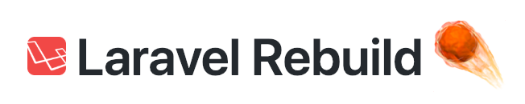
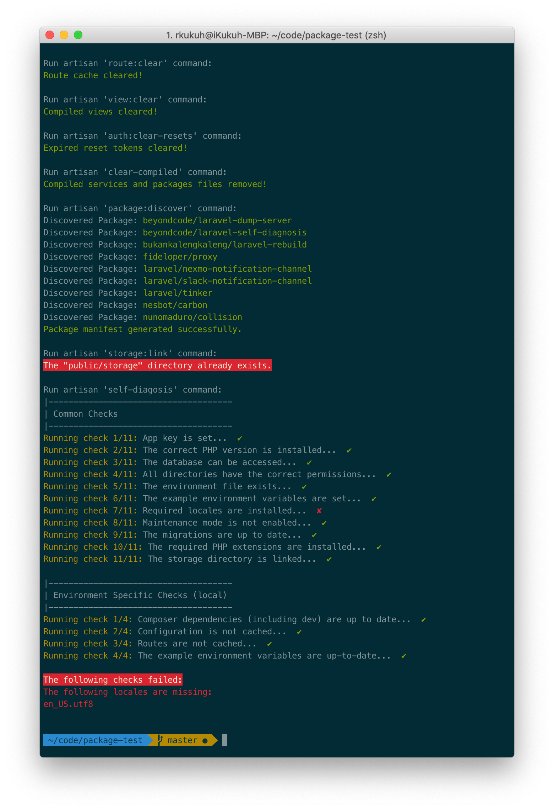

<p align="center"></p>

<p align="center">This readme is written in Bahasa. <a href="https://github.com/bukankalengkaleng/laravel-rebuild/blob/master/README.EN.md">English version is here</a></p>

---

| Development | Code Quality | Release | 
| :---------: | :----------: | :-----: |
| [](https://travis-ci.org/bukankalengkaleng/laravel-rebuild) <br> [](https://codeclimate.com/github/bukankalengkaleng/laravel-rebuild/maintainability) <br> [](https://codeclimate.com/github/bukankalengkaleng/laravel-rebuild/test_coverage) | [](https://scrutinizer-ci.com/g/bukankalengkaleng/laravel-rebuild/?branch=master) <br> [](https://codecov.io/gh/bukankalengkaleng/laravel-rebuild) <br> [](https://scrutinizer-ci.com/code-intelligence) | [](https://packagist.org/packages/bukankalengkaleng/laravel-rebuild) <br> [](https://packagist.org/packages/bukankalengkaleng/laravel-rebuild) <br> [](https://packagist.org/packages/bukankalengkaleng/laravel-rebuild) |

## Deskripsi

Artisan *command* untuk me-*rebuild* aplikasi Laravel.

## Motivasi

Proses *rebuild* aplikasi cukup memakan waktu dengan melakukan rangkaian perintah artisan seperti: *clearing caches, making fresh database schema, seeding initial data, seeding dummy data (if any), importing files (if any)*, dsb.  

Artisan *command* ini akan mempermudahnya.

## Instalasi

1. Jalankan perintah:
    ```
    composer require --dev bukankalengkaleng/laravel-rebuild
    ```

    Laravel v5.5 dan keatas akan otomatis meregistrasi package ini. Jika kamu menggunakan versi dibawah itu, kamu perlu melakukannya secara manual dalam file `config/app.php`:

    ```php
    'providers' => [
        // ...
        BukanKalengKaleng\LaravelRebuild\LaravelRebuildServiceProvider::class,
    ];
    ```
1. Pastikan aplikasi sudah bisa konek ke *database*

## Cara Menggunakan

1. Jalankan perintah:
    ```
    php artisan rebuild
    ```
1. Proses *rebuilding* aplikasi yang akan dilakukan adalah sebagai berikut:
    - Re-create database schema
    - Seeding initial data
    - Seeding dummy data, jika ada
    - Seeding example data, jika ada
    - Cache clear
    - Config clear
    - Route clear
    - View clear
    - Flush expired passwords
    - Compiled files clear
    - Rebuild packages
    - Create symbolic link
    - Self diagnosis

Proses *rebuilding* diatas dapat kamu atur dalam `config/rebuild.php`, yang harus kamu *publish* dahulu dengan cara:

```
php artisan vendor:publish --tag="laravel-rebuild"
```

## Screenshots

 

## Roadmap

Untuk mengetahui rencana kedepan package ini silahkan membaca [Roadmap](https://github.com/bukankalengkaleng/laravel-rebuild/blob/master/ROADMAP.md).

## Kontribusi [](https://github.com/bukankalengkaleng/laravel-rebuild/issues)

1. Kirim PR
1. Gak perlu baper kalo PR tertolak

## Catatan Revisi

Catatan revisi dapat dilihat di [Changelog](https://github.com/bukankalengkaleng/laravel-rebuild/blob/master/CHANGELOG.md) ini.

## Lisensi

Lisensi dari package ini adalah MIT License (MIT). Silahkan lihat bagian [Lisensi](https://github.com/bukankalengkaleng/laravel-rebuild/blob/master/LICENSE.md) ini untuk lebih jelasnya.
